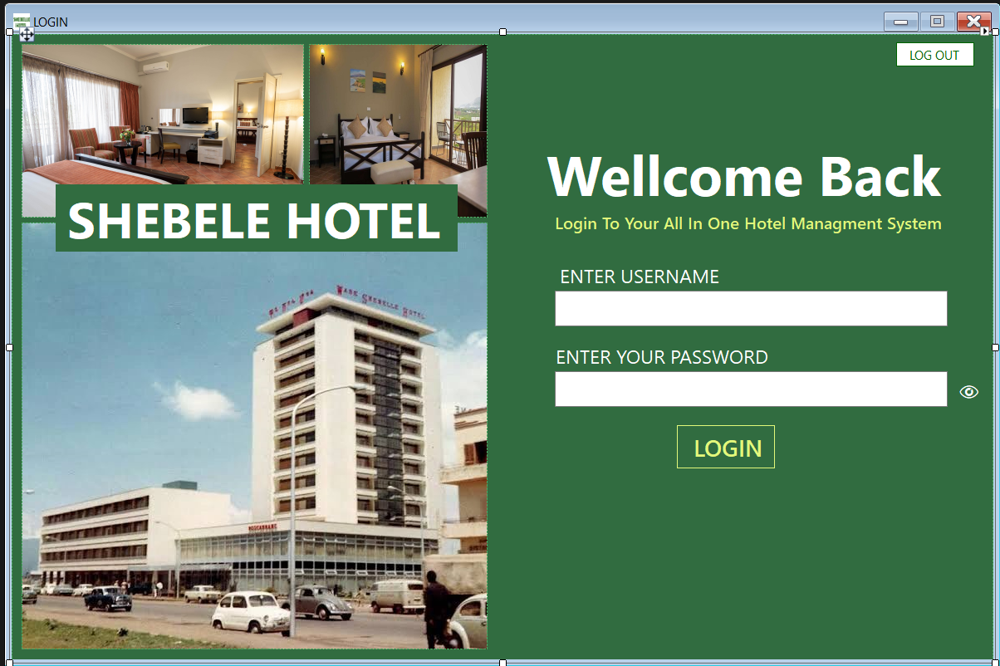
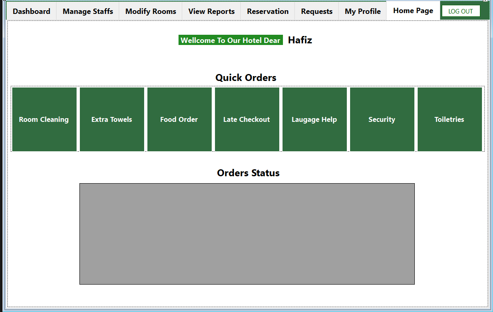
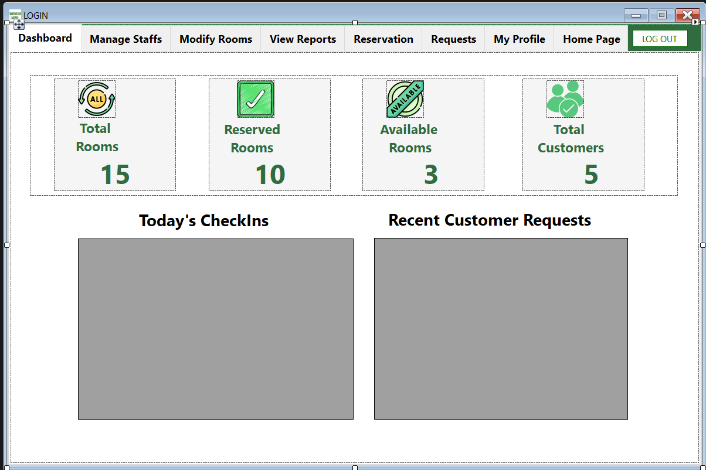
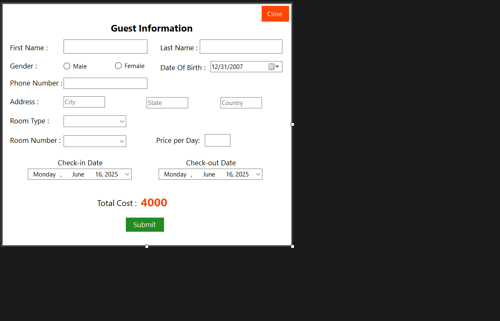
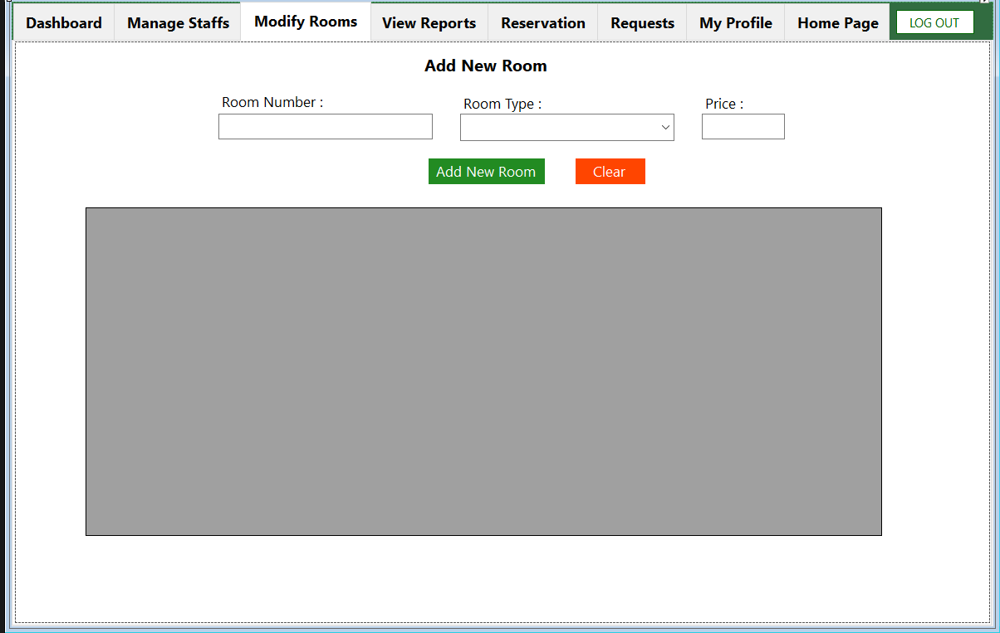

Hotel Management System
This is a basic Hotel Management System built using C#. It provides functionalities for managing reservations, rooms, and finances. This README will give you an overview of the project, how to set it up, and its main features.

Note: This project is currently under development and more features will be added in the future.

Table of Contents
Installation
Features
Screenshots
Usage
Contributing
License
Installation
Prerequisites:

.NET SDK installed on your system.
A suitable IDE for C# development (e.g., Visual Studio, Visual Studio Code with C# extension).
Clone the Repository:
Open your terminal or command prompt and navigate to the directory where you want to clone the project. Then run:
```bash
git clone &lt;repository_url>
```
(Replace <repository_url> with the actual URL of your GitHub repository)

Navigate to the Project Directory:
```bash
cd HotelManagementSystem
```

Restore Dependencies:
If the project uses NuGet packages, restore them using the .NET CLI:
```bash
dotnet restore
```

Build the Project:
```bash
dotnet build
```

Features
This Hotel Management System currently includes the following core features:

Reservation Management:

Create new reservations.
View existing reservations.
Modify reservation details (e.g., dates, room).
Cancel reservations.
Room Management:

Add new rooms to the system.
View available rooms.
Update room details (e.g., type, capacity, price).
Mark rooms as occupied or vacant.
Finance:

Record payments for reservations.
Generate basic financial reports (e.g., daily revenue).
Track outstanding balances.
Screenshots

### Login Form


### Homepage For Customer



### Main Dashboard


### Reservation Form


### Room Manage


Usage
Run the Application:
Navigate to the project's output directory (usually under bin/Debug or bin/Release) and run the executable file, or use the .NET CLI:
```bash
dotnet run
```

Follow the User Interface:
The application will likely have a command-line interface (CLI) or a graphical user interface (GUI). Follow the prompts or interact with the GUI elements to perform various operations such as creating reservations, managing rooms, and recording financial transactions.

More detailed usage instructions will be provided as the application develops.

Contributing
Contributions to this project are welcome. If you find a bug, have a suggestion for a new feature, or want to improve the code, please feel free to:

Fork the repository.
Create a new branch for your contribution.
Make your changes.
Commit your changes with a descriptive message.
Push your changes to your fork.
Submit a pull request to the main repository.
License
This project is licensed under the MIT License (or specify your preferred license). See the LICENSE file for more details.

Thank you for checking out the Hotel Management System!
